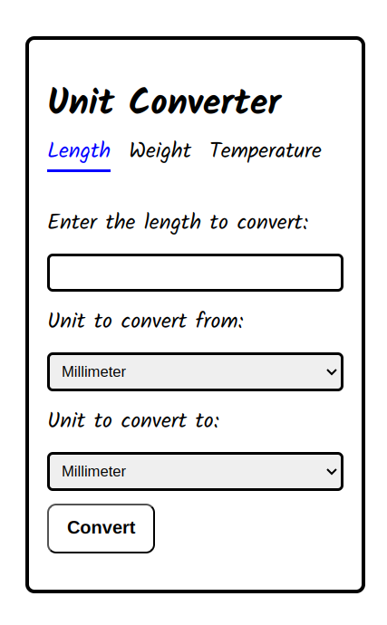
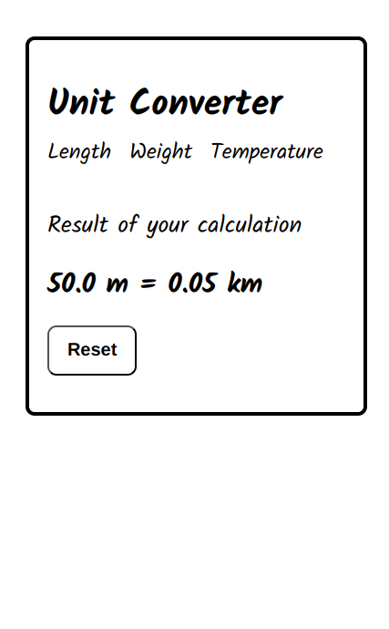

# Unit Converter Web App

A simple and functional unit converter web application, built as one of the backend projects recommended by [roadmap.sh](https://roadmap.sh/projects/unit-converter). This app enables users to convert values between various units of measurement, including length, weight, and temperature.

## Project Overview

The Unit Converter Web App allows users to input a value, select units to convert from and to, and view the converted result instantly. The application handles backend-powered dynamic conversions using Django and the `pint` library for precise unit calculations. As it does not rely on a database, no conversion history is stored.

### Supported Conversion Categories

1. **Length**: millimeter, centimeter, meter, kilometer, inch, foot, yard, mile
2. **Weight**: milligram, gram, kilogram, ounce, pound
3. **Temperature**: Celsius, Fahrenheit, Kelvin

## Features

- **Dynamic Conversions**: Supports accurate conversions between supported units for length, weight, and temperature.
- **Responsive Input Forms**: Users can easily input values and select units using dropdown menus.
- **Result Formatting**: Large numbers are formatted using scientific notation for readability.
- **Clear URL Structure**: Each conversion type has a dedicated page.

## How to Run the Project Locally

Follow these steps to set up and run the project on your local machine.

### Prerequisites

- Python 3.x installed
- Django 4.x or higher
- A text editor or IDE (e.g., VS Code, PyCharm)

### Steps to Run

1. **Clone the Repository**:

   ```bash
   git clone https://github.com/hakeemyusuff/Unit_converter.git
   cd Unit_converter
   ```

2. **Create a virtual environment**

    ```bash
    python -m venv env
    ```

    Activate the environment:

    On windows:

    ```bash
    .\env\Scripts\activate
    ```

    On macOS/Linux:

    ```bash
    source /env/bin/activate
    ```

3. **Install Dependencies:** Ensure you have ```pip``` installed, then run:

    ```bash
    pip install -r requirements.txt
    ```

4. **Run Development Server:**

    ```bash
    python manage.py runserver
    ```

    By default the server will be available at ```http://127.0.0.1:8000```

5. **Access the App using:**

    ```http://127.0.0.1:8000/converter/length```

## File Structure

- ```views.py:``` Contains logic for rendering pages and handling unit conversions.

- ```forms.py:``` Defines forms for length, weight, and temperature conversions with validation.

- ```urls.py:``` Maps URLs to corresponding views.

- ```Templates/:```  Includes HTML files for the home page, conversion forms, and results.

## Example Workflow

1. Visit one of the conversion pages (e.g., length).
2. Input a value, select units to convert from and to, and click on convert.
3. The app calculates and displays the result dynamically on the page.

## Screenshots





## Acknowledgments

This project is part of the [roadmap.sh backend roadmap](https://roadmap.sh/projects/unit-converter). Thanks to roadmap.sh for providing a structured path for developers to grow their skills.
